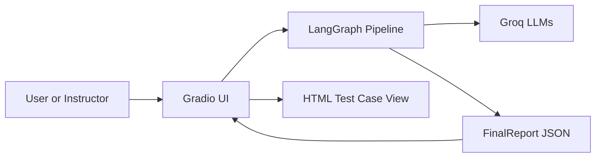
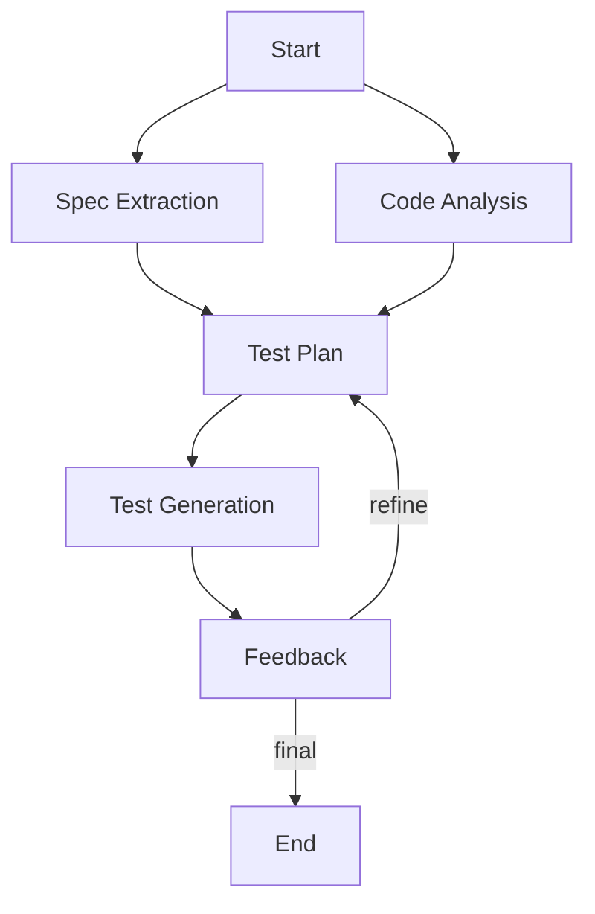
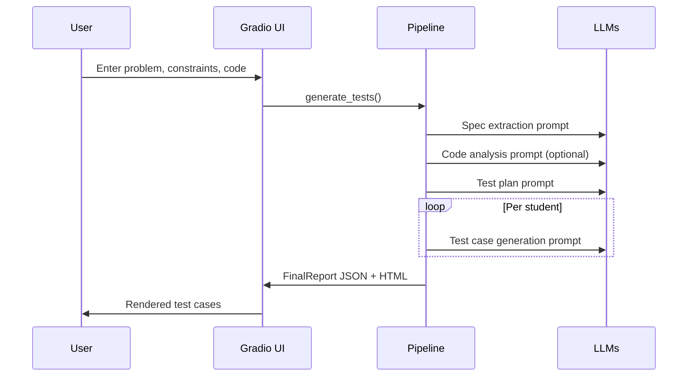
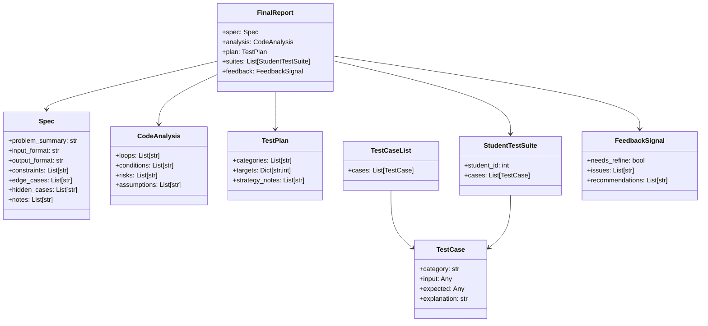
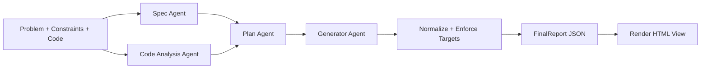
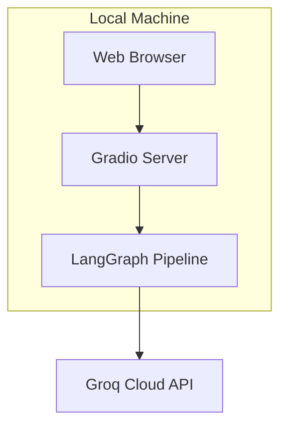
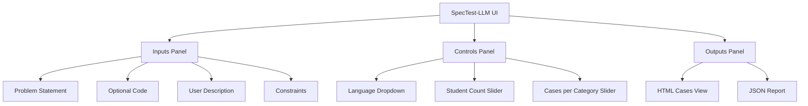
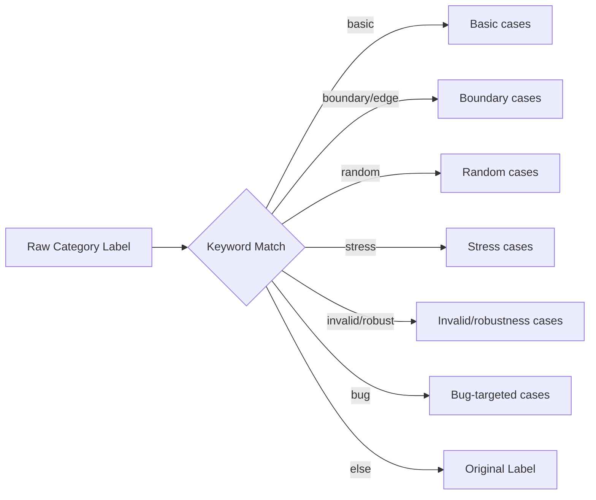
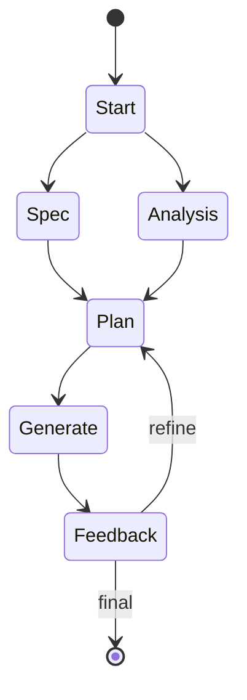

# SpecTest-LLM Project Synopsis

## Title

SpecTest-LLM: Multi-agent test case generation for programming problems

Prepared for: [Institution or Course]

Prepared by: [Your Name]

Date: [YYYY-MM-DD]

\pagebreak

## Table of Contents

1. Introduction
2. Literature Survey
3. Problem Statement
4. Objectives
5. Design and Architecture
6. Functional Requirements
7. Expected Outcome
8. References

\pagebreak

## 1. Introduction

SpecTest-LLM is a lightweight, interactive system that generates explainable
test cases for programming problems. The system accepts a problem statement,
optional source code, and user constraints. It then orchestrates a multi-agent
LLM pipeline to produce categorized test cases, grouped per student, with
structured JSON output and a readable HTML view.

The implementation in this repository is intentionally minimal and focuses on
clarity: a Gradio UI collects input, a LangGraph pipeline coordinates multiple
LLM roles, and a small schema layer validates all outputs. The design is meant
for teaching and evaluation settings where instructors need fast, diverse, and
explainable test cases that target boundary conditions, random inputs, stress
cases, invalid inputs, and bug-focused scenarios.

\pagebreak

### 1.1 Background and Context

Test case generation is a recurring pain point in programming courses and
evaluation platforms. Human-authored tests are time-consuming, and a small set
of examples can miss edge cases or allow brittle solutions to pass.
SpecTest-LLM responds to this need by combining natural language requirements
with optional code inspection and a structured test planning step.

The pipeline uses specialized agents that each focus on a distinct task:
requirements extraction, code analysis, test planning, and test generation.
The system also applies validation and normalization to LLM outputs to keep
the final test suites consistent and reliable.

\pagebreak

### 1.2 Scope and Assumptions

Scope of the current implementation:

- Accepts a problem statement and optional code in a Gradio web interface.
- Supports a defined set of languages (python, cpp, java, javascript, go,
  other) for input metadata.
- Generates a structured test plan and concrete test cases using Groq-hosted
  models (`openai/gpt-oss-120b`) via LangChain over an OpenAI-compatible API.
- Enforces a fixed set of test categories and per-category counts.
- Produces an HTML view and JSON report for downstream use.

Key assumptions in this synopsis:

- The user provides a clear and complete problem statement.
- The optional code is used for analysis only and is not executed.
- An API key for Groq Cloud is available via the environment variable
  GROQ_CLOUD_API_KEY.
- The system runs as a local service with no database and no external
  persistence layer.

\pagebreak

### 1.3 Methodology Overview

The project follows a pipeline-centric methodology that treats test case
generation as a sequence of structured transformations:

1. Requirement capture: Convert natural language statements into a structured
   specification.
2. Optional code analysis: Extract potential risks and assumptions from code
   without executing it.
3. Test planning: Create a balanced coverage plan with explicit targets.
4. Test generation: Produce concrete cases that match the plan constraints.
5. Validation: Normalize categories and enforce target counts.
6. Presentation: Render results as both JSON and human-readable HTML.

This methodology is chosen to keep each step auditable and to make the outputs
explainable for educators. The emphasis is on structured artifacts rather than
free-form text, which supports downstream evaluation and reuse.

\pagebreak

### 1.4 Typical Use Cases

The system is designed for the following use cases:

- Course instructors generating diversified test suites for weekly exercises.
- Teaching assistants verifying student solutions against robust criteria.
- Competitive programming practice sessions where coverage is a concern.
- Internal code review sessions where inputs must reflect edge conditions.

By supporting multi-student generation in a single run, the tool can simulate
variation between student submissions, ensuring that each student receives a
different but balanced set of cases.

\pagebreak

### 1.5 Stakeholders and Users

Primary stakeholders include instructors, teaching assistants, and students.
Secondary stakeholders include tool maintainers and course administrators.

Stakeholder needs:

- Instructors need quick, explainable, and consistent test suites.
- TAs need structured outputs that can be reviewed rapidly.
- Students benefit from better coverage and clearer feedback.
- Maintainers need a modular system that can be extended or replaced.

\pagebreak

### 1.6 Constraints and Risks

Key constraints and risks include:

- Dependence on external LLM availability and API quotas.
- Variability in LLM outputs despite schema enforcement.
- Limited refinement loops to keep latency low.
- Lack of persistent storage for long-term traceability.

These risks are mitigated with structured parsing, deterministic category
targets, and a lightweight runtime footprint.

\pagebreak

## 2. Literature Survey

This survey focuses on the families of techniques relevant to automated test
case generation and how SpecTest-LLM aligns with or differs from those
approaches. The goal is to situate the project within practical software
engineering practices without overclaiming beyond the codebase.

\pagebreak

### 2.1 Rule-based and Template-driven Test Generation

Rule-based generators encode domain knowledge directly, such as input ranges
and boundary values. These systems are predictable and easy to validate, but
they scale poorly across problem domains because they require manual rules for
each new specification. Template approaches also struggle with problems that
depend on nuanced textual requirements.

SpecTest-LLM reduces manual rule writing by extracting requirements from
natural language and distributing them to multiple agents that can generalize
across problem statements. The system still enforces fixed categories and
counts to retain predictability.

\pagebreak

### 2.2 Constraint-based and Symbolic Techniques

Constraint solvers and symbolic execution can systematically explore program
paths to generate inputs that satisfy or violate logical conditions. These
approaches are powerful but typically require the program to be executable,
which is not always available in educational contexts. They can also be costly
to run for large programs or high-dimensional input spaces.

SpecTest-LLM does not rely on program execution. Instead, it performs a
lightweight static analysis via LLM interpretation when code is provided, and
falls back to the problem statement when it is not. This makes it more
accessible for use with partial or draft solutions.

\pagebreak

### 2.3 Random Testing and Fuzzing

Random input generation and fuzzing are effective for discovering unexpected
failures, especially in robustness and input validation. The tradeoff is that
random inputs often lack semantic meaning and can be difficult to explain or
justify in a teaching context.

SpecTest-LLM includes a Random cases category but pairs it with other targeted
categories and provides explanations for each test case. This helps preserve
the exploratory value of randomness while keeping the outcomes interpretable.

\pagebreak

### 2.4 LLM-based Test Generation

Large language models can synthesize test cases by interpreting problem
statements and generating plausible inputs and expected outputs. Their
strength is flexibility and domain breadth, but they can hallucinate or
produce inconsistent formatting.

The implementation in this repository uses strict Pydantic schemas and parsing
guardrails. It also enforces category targets and normalizes labels to limit
variability. These measures support consistent output without fully removing
the creative flexibility of the model.

\pagebreak

### 2.5 Multi-agent Orchestration

Multi-agent systems decompose complex tasks into smaller roles, such as
requirements extraction and test planning. This decomposition can improve
quality by aligning each agent with a narrow objective and by allowing
refinement loops when issues are detected.

SpecTest-LLM uses a LangGraph pipeline with explicit nodes for spec extraction,
code analysis, plan generation, case generation, and feedback. A conditional
edge triggers a single refinement cycle if test suites are missing required
categories.

\pagebreak

### 2.6 Schema-guided Parsing and Validation

Schema-driven validation is a pragmatic way to keep LLM outputs structured.
Instead of free-form text, the output is parsed into typed models. Invalid or
incomplete outputs can be detected early and corrected or discarded.

SpecTest-LLM uses Pydantic models for the specification, analysis, test plan,
test case list, feedback signal, and final report. This ensures a consistent
contract between the UI and the pipeline, and simplifies rendering to HTML and
JSON.

\pagebreak

### 2.7 Evaluation Metrics in Test Generation

Common evaluation criteria include coverage, diversity, validity, and
explainability. Coverage measures whether generated cases span normal and edge
conditions. Diversity captures the variability of inputs and conditions.
Validity ensures that inputs respect the input format or intentionally violate
it for robustness testing. Explainability measures how well each case can be
justified in plain language.

SpecTest-LLM explicitly encodes these criteria by using multiple categories and
by attaching a short explanation to each generated test case.

\pagebreak

### 2.8 Practical Considerations for Education

Educational environments often prioritize interpretability and fairness. Test
cases must be understandable and defensible to students. Automated systems that
cannot provide explanations are frequently rejected despite technical strength.

By generating an explanation for each case and grouping cases by category, the
system aligns with the educational need for transparency and feedback.

\pagebreak

### 2.9 Summary of Survey Findings

The literature indicates a tradeoff between systematic precision and practical
usability. Rule-based and symbolic approaches provide strong guarantees but are
expensive or inflexible. LLM-based approaches are flexible but must be guided
with schemas and validation. A multi-agent pipeline with enforced structure is
a practical middle ground for classroom-scale deployments.

\pagebreak

## 3. Problem Statement

Educational and evaluation environments need reliable, diverse test cases for
programming problems. Manual authoring is time-consuming and often fails to
cover edge conditions, invalid inputs, and robustness scenarios. Existing
automated methods can be either too rigid or too opaque, leading to test suites
that are either shallow or hard to justify.

The problem is to design a system that generates explainable, categorized test
cases from natural language problem statements, optionally using submitted code
for additional analysis. The system must output structured data suitable for
review, reuse, and downstream tooling, while remaining lightweight enough to
run as a local interactive service.

\pagebreak

### 3.1 Design Constraints

The system operates under several constraints derived from the repository:

- It relies on external LLMs accessed through API keys.
- It does not execute user-provided code, only analyzes it.
- It does not store test suites or metadata persistently.
- It is designed for interactive, single-session use.

These constraints shape the architecture and require strong input validation
and structured output handling.

\pagebreak

### 3.2 Research Questions

The project implicitly addresses the following questions:

1. Can structured prompting and schema validation produce consistent test
   suites from natural language specifications?
2. Does multi-agent decomposition improve test coverage compared to a single
   prompt approach?
3. How much can output normalization mitigate LLM variability in practice?

These questions guide the design of the pipeline and the inclusion of a
feedback and refinement step.

\pagebreak

## 4. Objectives

The primary objectives of SpecTest-LLM are:

1. Extract a concise, structured specification from a natural language problem
   statement and user-provided constraints.
2. Analyze optional source code for potential risks and assumptions without
   executing it.
3. Create a balanced test plan that covers essential categories such as basic,
   boundary, random, stress, invalid, and bug-targeted cases.
4. Generate concrete test cases per student with explanations and literal JSON
   inputs, avoiding expressions or dynamic code.
5. Normalize and enforce category counts to guarantee coverage consistency.
6. Provide an interactive UI for input collection and an easy-to-read HTML
   output for instructors.
7. Offer a clean JSON report for programmatic use or downstream processing.

\pagebreak

### 4.1 Non-functional Objectives

In addition to functional goals, the system targets the following qualities:

- Usability: minimal steps to generate results via a web UI.
- Reliability: consistent category names and required counts.
- Transparency: explanations for each test case.
- Maintainability: clear module boundaries and typed schemas.
- Portability: runs locally with a minimal dependency set.

\pagebreak

## 5. Design and Architecture

SpecTest-LLM is composed of a small set of Python modules that together form a
complete pipeline. The design emphasizes modularity and explicit data flow.

- app.py hosts the Gradio UI and renders the HTML report.
- graph.py defines the LangGraph pipeline and output processing logic.
- agents.py defines LLM prompts and parsers for each role.
- schemas.py defines Pydantic models that structure all data.
- llms.py configures Groq model access via environment variables.

\pagebreak

### 5.1 System Context Diagram



This diagram shows the top-level system components and their interactions. The
UI is a thin layer that triggers the pipeline and displays results. The
pipeline orchestrates multiple LLM calls and returns a structured report.

\pagebreak

### 5.2 LangGraph Pipeline Flow



The pipeline has explicit parallel preparation steps (spec extraction and code
analysis) that converge into a test plan. Generation produces test cases per
student, and feedback decides whether to refine once before finalizing.

\pagebreak

### 5.3 Request Sequence



The sequence emphasizes the separation of concerns between UI, pipeline, and
LLM roles. Each prompt is designed to return JSON that maps to a schema.

\pagebreak

### 5.4 Data Model Overview



These classes define the contract for every stage. LLM outputs are parsed into
these structures, and the final report includes all upstream artifacts.

\pagebreak

### 5.5 Module Responsibilities

app.py

- Collects user inputs (problem statement, constraints, code, language).
- Provides sliders for student count (1 to 50) and cases per category (2 to 3).
- Calls run_pipeline and renders HTML with category grouping and copy buttons.
- Outputs JSON report alongside the HTML view.

agents.py

- Defines prompt templates for each LLM role.
- Couples prompts with Pydantic output parsers.
- Enforces JSON-only responses for each role.

graph.py

- Builds the LangGraph state machine.
- Enforces category targets and normalizes category labels.
- Parses and repairs JSON outputs from generation agents.
- Manages a single refinement cycle via feedback.

llms.py

- Loads GROQ_CLOUD_API_KEY from the environment.
- Instantiates ChatOpenAI models (pointed at Groq's OpenAI-compatible
  endpoint) with specified temperatures.

schemas.py

- Defines all Pydantic models used across the pipeline.
- Centralizes the data contract between components.

\pagebreak

### 5.6 Input and Output Data Flow



This flow separates raw user inputs from validated outputs and shows the
normalization and enforcement step that stabilizes the result.

\pagebreak

### 5.7 Output Repair and Category Enforcement

LLM responses can contain formatting issues. The pipeline includes a sequence
of cleanup and validation steps:

- Strip markdown fences if present.
- Extract the JSON object or list from surrounding text.
- Rewrite JavaScript style .repeat calls into literal string expressions.
- Evaluate simple string expressions like "a" * 5 or "a" + "b".
- Parse JSON into TestCaseList and discard outputs that fail validation.
- Normalize category labels to the six canonical categories.
- Enforce per-category targets and record missing categories as issues.

This layer is critical for converting flexible model output into deterministic
data structures suitable for evaluation.

\pagebreak

### 5.8 Configuration and Runtime Considerations

- The system requires GROQ_CLOUD_API_KEY in the environment.
- The service is launched via Gradio on 0.0.0.0:7860.
- No persistent storage is used; all outputs are generated per request.
- The UI provides copy-to-clipboard functionality using browser APIs.

These constraints keep the system lightweight and easy to run locally but
imply that results are ephemeral unless exported or copied.

\pagebreak

### 5.9 Deployment Diagram



The deployment is simple: a single Gradio server and a local pipeline process
talk to the external LLM API. No database is required.

\pagebreak

### 5.10 UI Layout Sketch



This layout mirrors the Gradio structure in app.py and helps explain the user
workflow during demonstrations or evaluations.

\pagebreak

### 5.11 Error Handling and Failure Modes

The system handles errors in a pragmatic way:

- Empty problem statements return a JSON error message.
- Parsing failures for test case lists yield empty suites and trigger issues.
- Missing categories are logged as issues and can trigger a refinement cycle.
- Missing API keys are handled as runtime errors before LLM invocation.

The feedback node consolidates issues and decides whether a refinement cycle is
needed. The pipeline only refines once to prevent excessive latency.

\pagebreak

### 5.12 Category Normalization Diagram



This diagram reflects the normalization logic in graph.py and explains how
variable labels are mapped to the canonical set.

\pagebreak

### 5.13 Prompt-Output Contract Example

Example output for a single test case list (simplified):

```json
{
  "cases": [
    {
      "category": "Boundary cases",
      "input": [0],
      "expected": 0,
      "explanation": "Tests the lower boundary of input size"
    }
  ]
}
```

This illustrates the JSON-only contract required from the LLM. The parser
expects literal JSON values without expressions or code.

\pagebreak

### 5.14 Test Category Coverage Matrix

The fixed category set guarantees coverage across multiple risk areas:

| Category | Purpose | Typical Example |
| --- | --- | --- |
| Basic cases | Validate normal inputs | Small valid arrays |
| Boundary cases | Stress edges of constraints | Min and max sizes |
| Random cases | Explore input space | Random valid inputs |
| Stress cases | Performance pressure | Large input sizes |
| Invalid/robustness cases | Error handling | Empty or malformed inputs |
| Bug-targeted cases | Known failure patterns | Off-by-one inputs |

This matrix can be used to explain the coverage rationale to evaluators.

\pagebreak

### 5.15 State Transition Detail



This view emphasizes the conditional refinement and the parallel entry paths
for spec extraction and code analysis.

\pagebreak

## 6. Functional Requirements

The functional requirements are derived directly from the implemented modules
and the UI behavior.

1. Accept a non-empty problem statement and reject empty submissions.
2. Accept optional source code for analysis without executing it.
3. Allow users to specify a language from a predefined list.
4. Allow users to specify the number of students (1 to 50).
5. Allow users to specify cases per category (2 to 3).
6. Extract a structured specification from problem statement and constraints.
7. Perform optional code analysis and record potential risks and assumptions.
8. Generate a test plan with fixed categories and target counts.
9. Generate concrete test cases per student based on the plan targets.
10. Normalize category labels to the canonical six categories.
11. Enforce per-category targets and track missing categories as issues.
12. Provide a JSON report containing spec, analysis, plan, suites, and feedback.
13. Provide an HTML rendering of test cases grouped by student and category.
14. Provide a copy button to copy one student suite at a time.

\pagebreak

### 6.1 Functional Requirements by Subsystem

UI Requirements (app.py)

1. Render input fields for problem, description, constraints, and code.
2. Provide a language dropdown with predefined choices.
3. Provide sliders for student count and cases per category.
4. Render the generated report as HTML and JSON in the same interface.

Pipeline Requirements (graph.py and agents.py)

1. Use dedicated agents for spec extraction, code analysis, planning,
   generation, and feedback.
2. Re-run planning once when feedback or missing categories indicate issues.
3. Use fixed category names and per-category targets for all test suites.

Model Integration Requirements (llms.py)

1. Instantiate Groq-hosted LLMs with configured temperature per role.
2. Fail fast when GROQ_CLOUD_API_KEY is not set.

Data Contract Requirements (schemas.py)

1. Enforce structured JSON for all intermediate and final outputs.
2. Ensure every test case has a category, input, and explanation.
3. Store final results as a composite FinalReport model.

\pagebreak

### 6.2 Non-functional Requirements

1. Usability: Generate results within a small number of clicks.
2. Performance: Handle up to 50 students with minimal UI lag.
3. Reliability: Enforce fixed category coverage per student.
4. Maintainability: Keep logic separated across app, graph, agents, and schemas.
5. Security: Do not execute user-provided code.
6. Portability: Run locally without additional services beyond the LLM API.

\pagebreak

### 6.3 Input Validation Rules

Validation and constraints applied in the current implementation:

- Problem statement must be non-empty.
- Student count is clamped to 1..50 in the UI slider.
- Cases per category are restricted to 2..3 in the UI slider.
- Code input is optional and treated as text only.
- Output JSON must validate against Pydantic schemas.

These rules prevent invalid pipeline states and keep outputs predictable.

\pagebreak

### 6.4 Output Formatting Requirements

1. JSON outputs must use literal values only.
2. Category labels must match the canonical set after normalization.
3. Each test case must include a category, input, and explanation.
4. HTML output must group by student and by category.
5. Copy-to-clipboard must include a text summary of the student's cases.

\pagebreak

### 6.5 Observability and Diagnostics

While no explicit logging framework is included, diagnostic behavior exists in
the form of issue lists and feedback signals. These fields can be exported for
analysis or debugging if desired.

Potential future enhancements could add structured logs or telemetry, but the
current repository intentionally keeps runtime minimal.

\pagebreak

## 7. Expected Outcome

SpecTest-LLM should produce clear, categorized test suites that improve
coverage of typical student solutions and reduce the burden of manual test
authoring. The expected outcome includes both a human-friendly view and a
machine-friendly report.

Key outcomes:

- A structured specification summarizing the problem statement.
- A test plan with targets across six categories.
- Per-student test suites that meet category quotas.
- A JSON report that can be reused by evaluators or tools.
- An HTML display that supports quick review and copy-to-clipboard actions.

\pagebreak

### 7.1 Success Criteria

The system is considered successful if it meets the following criteria:

1. Produces non-empty test suites when provided with a valid problem statement.
2. Maintains consistency of category names and per-category counts.
3. Avoids invalid JSON in output and provides structured data for every stage.
4. Supports multiple students in a single run without cross-contamination.
5. Provides clear explanations that justify the intent of each test case.

\pagebreak

### 7.2 Limitations

The current implementation has the following limitations:

- Only a single refinement cycle is performed, which may not fully correct
  persistent generation errors.
- No persistent storage is provided for versioning or audit trails.
- The system does not validate expected outputs against an oracle program.
- LLM outputs can still vary between runs, especially for complex statements.

These limitations are acceptable for prototype and educational use but may
need extension for production-grade assessment platforms.

\pagebreak

### 7.3 Future Enhancements

1. Add a persistence layer to store generated suites and metadata.
2. Support user-defined categories and per-category counts.
3. Integrate an optional reference solution to validate expected outputs.
4. Add automated evaluation metrics such as coverage proxies.
5. Provide a batch mode for multiple problem statements.

\pagebreak

### 7.4 Evaluation Plan

Evaluation can be performed along three axes:

- Coverage: measure whether generated cases reflect edge and boundary
  conditions stated in the input.
- Consistency: confirm category counts and schema validity across runs.
- Usability: collect feedback from instructors on readability and utility.

Metrics can be gathered by sampling multiple problem statements and comparing
the distribution of categories and issue counts.

\pagebreak

### 7.5 Sample Output Snapshot

```json
{
  "spec": { "problem_summary": "...", "input_format": "...", "output_format": "..." },
  "analysis": { "loops": [], "conditions": [], "risks": [], "assumptions": [] },
  "plan": { "categories": ["Basic cases"], "targets": {"Basic cases": 2}, "strategy_notes": [] },
  "suites": [
    {
      "student_id": 1,
      "cases": [
        { "category": "Basic cases", "input": [1], "expected": 1, "explanation": "..." }
      ]
    }
  ],
  "feedback": { "needs_refine": false, "issues": [], "recommendations": [] }
}
```

This snapshot demonstrates the shape of the report. Actual content depends on
the problem statement and LLM output.

\pagebreak

## 8. References

Project source files:

- app.py
- agents.py
- graph.py
- llms.py
- schemas.py
- requirements.txt

Key runtime dependencies as listed in requirements.txt:

- langgraph
- langchain
- langchain-openai
- pydantic
- python-dotenv
- gradio

Notes:

- This synopsis is based on the current repository contents and does not
  include external datasets or third-party services beyond the listed
  dependencies.

\pagebreak

### 8.1 Glossary

- LLM: Large Language Model used for prompt-based generation.
- Schema: A structured definition of expected JSON fields.
- Test plan: A set of category targets that guide test generation.
- Test suite: A collection of test cases for a specific student.
- Refinement: A re-run of planning to address detected issues.
